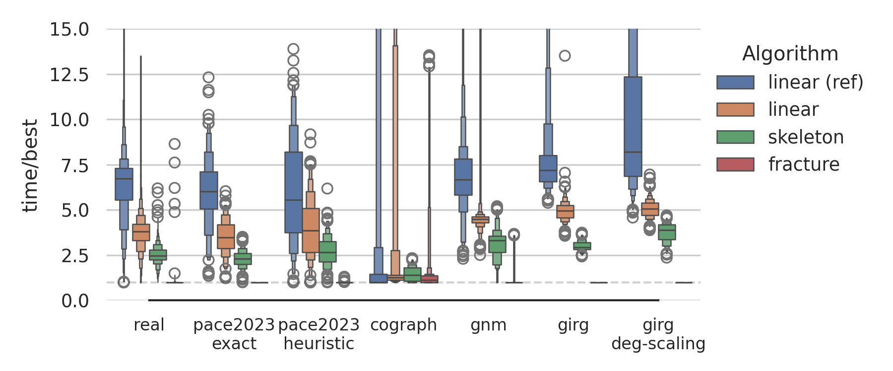

# Modular Decomposition

A library to compute the [modular decomposition](https://en.wikipedia.org/wiki/Modular_decomposition) of a
simple, undirected graph.

[](https://docs.rs/modular-decomposition) [](https://coveralls.io/github/jonasspinner/modular-decomposition?branch=main) [](https://crates.io/crates/modular-decomposition) [](./LICENSE)

A node set *M* is a *module* if every node has the same neighborhood outside *M*. The set of all nodes *V* and the sets
with a single node *{u}* are
trivial modules.

The modular decomposition algorithm in this library has a O(n + m log n) running time and is based
on [[HPV99]](https://doi.org/10.1142/S0129054199000125) and [[CHM02]](https://doi.org/10.46298/dmtcs.298). Although
linear time algorithms exists, they perform worse in comparison.

## Examples

The smallest prime graph is the path graph on 4 nodes.

```rust
use petgraph::graph::UnGraph;
use modular_decomposition::{ModuleKind, modular_decomposition};

// a path graph with 4 nodes
let graph = UnGraph::<(), ()>::from_edges([(0, 1), (1, 2), (2, 3)]);
let md = modular_decomposition(&graph)?;

assert_eq!(md.module_kind(md.root()), Some(&ModuleKind::Prime));
```

Determining whether a graph is a [cograph](https://en.wikipedia.org/wiki/Cograph).

```rust
use petgraph::graph::UnGraph;
use modular_decomposition::{ModuleKind, modular_decomposition};

// a complete graph with 3 nodes
let graph = UnGraph::<(), ()>::from_edges([(0, 1), (0, 2), (1, 2)]);
let md = modular_decomposition(&graph)?;

// a graph is a cograph exactly if none of its modules is prime
let is_cograph = md.module_kinds().all(|kind| *kind != ModuleKind::Prime);
assert!(is_cograph);
```

## Generics

The algorithm is implemented for structs that implement the `petgraph`
traits `NodeCompactIndexable`, `IntoNeighbors`, and `GraphProp<EdgeType = Undirected>`.

## Evaluation



As part of a thesis, we evaluated four implementations of modular decomposition algorithms.
The `fracture` algorithm performs best and is provided in this library. For more information see
the [repository](https://github.com/jonasspinner/modular-decomposition/).
