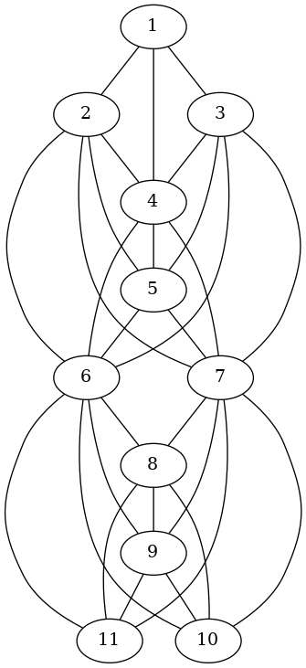
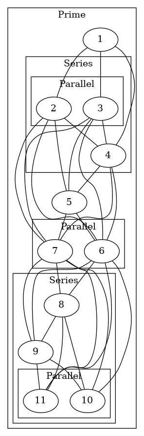

https://graphviz.org/Gallery/directed/cluster.html
https://stackoverflow.com/questions/2012036/graphviz-how-to-connect-subgraphs


Referenced [Kar19](https://github.com/StefanKarpinski/GraphModularDecomposition.jl/blob/a4f2b62a45523024eebea18daba5da18028dc824/test/runtests.jl#L57-L66).
```Julia
# from Habib & Paul 2009 (and Wikipedia)
G = sparse(
    [1, 1, 1, 2, 2, 2, 2, 2, 3, 3, 3, 3, 3, 4, 4, 4, 4, 4, 4, 5,
     5, 5, 5, 5, 6, 6, 6, 6, 6, 6, 6, 6, 7, 7, 7, 7, 7, 7, 7, 7,
     8, 8, 8, 8, 8, 9, 9, 9, 9, 9, 10, 10, 10, 10, 11, 11, 11, 11],
    [2, 3, 4, 1, 4, 5, 6, 7, 1, 4, 5, 6, 7, 1, 2, 3, 5, 6, 7, 2,
     3, 4, 6, 7, 2, 3, 4, 5, 8, 9, 10, 11, 2, 3, 4, 5, 8, 9, 10,
     11, 6, 7, 9, 10, 11, 6, 7, 8, 10, 11, 6, 7, 8, 9, 6, 7, 8, 9],
    1
)
T = sort!(StrongModuleTree(G))
@test repr(T) == "{1 ((2 3) 4) 5 (6 7) (8 9 (10 11))}"
test_permutations(G, T)
```

```python
import networkx as nx
heads = [1, 1, 1, 2, 2, 2, 2, 2, 3, 3, 3, 3, 3, 4, 4, 4, 4, 4, 4, 5,
          5, 5, 5, 5, 6, 6, 6, 6, 6, 6, 6, 6, 7, 7, 7, 7, 7, 7, 7, 7,
          8, 8, 8, 8, 8, 9, 9, 9, 9, 9, 10, 10, 10, 10, 11, 11, 11, 11]
tails = [2, 3, 4, 1, 4, 5, 6, 7, 1, 4, 5, 6, 7, 1, 2, 3, 5, 6, 7, 2,
         3, 4, 6, 7, 2, 3, 4, 5, 8, 9, 10, 11, 2, 3, 4, 5, 8, 9, 10,
         11, 6, 7, 9, 10, 11, 6, 7, 8, 10, 11, 6, 7, 8, 9, 6, 7, 8, 9]
G = nx.Graph(zip(heads, tails))
print([(u, v) for u, v in G.edges()])
print("\n".join([f"{u} -- {v}" for u, v in G.edges()]))
```



